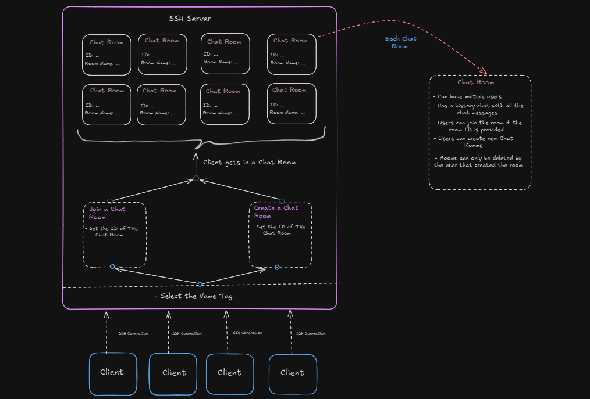

# Secure Communication Over SSH - CLI Tool  
**Technologies:** Golang, Docker, SSH

## What is SSH?  
SSH (Secure Shell) is a cryptographic network protocol used to securely operate network services over an unsecured network. It provides a secure channel over an insecure network by using strong encryption, authentication, and integrity protections.

## Project Goal  
The goal of this project is to create a terminal-based tool that enables secure communication between users, either one-on-one or in chat rooms, without relying on third-party services that may compromise user privacy.

By leveraging an SSH server and the SSH protocol, the application establishes end-to-end encrypted connections between multiple users who have access to the same server. This eliminates the need to trust external platforms with sensitive data, significantly enhancing the privacy and security of user communications.

## Project Overview  
Below is a diagram providing a simplified overview of the entire SSH Chat App, which helps explain how everything works.

